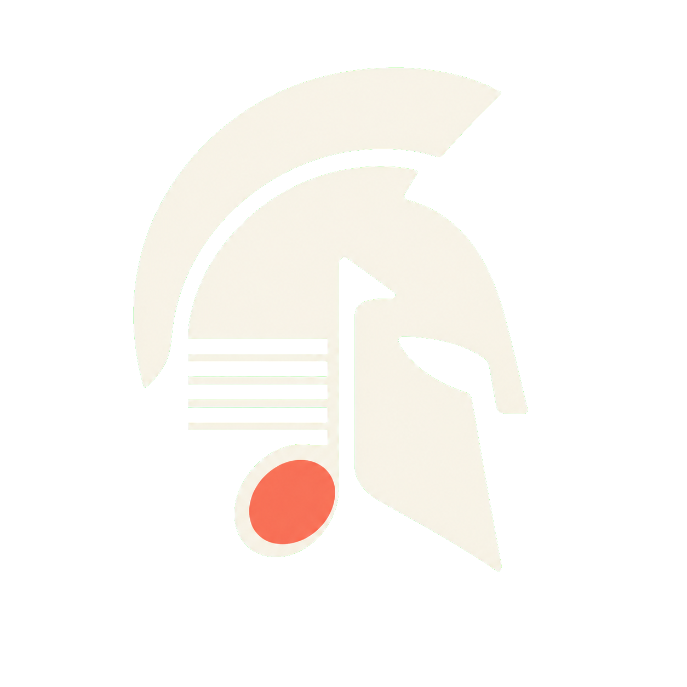

<p align="center">
  
</p>

<h1 align="center">AthenaNotation</h1>

<p align="center">
  面向 iPadOS、macOS 和 Android 的原生 Swift 乐谱引擎。
</p>

<p align="center">
  <a href="README.md">English</a> · <a href="README.zh-CN.md">简体中文</a>
</p>

[](https://github.com/cubehead/AthenaNotation/actions/workflows/ci.yml)
[](https://www.swift.org/)
[](Package.swift)
[](AthenaNotation.podspec)
[](LICENSE)

AthenaNotation 提供乐谱语义模型、排版、SwiftUI 渲染、MusicXML/MIDI
导入和乐谱时间线分析，不依赖 WebView、JavaScript 渲染器或第三方 MIDI
运行库。

> **项目状态：** AthenaNotation 1.0 已建立版本化公开 API 基线，并遵循语义化
> 版本。详见[公开 API 稳定性](Documentation/APIStability.zh-CN.md)。

## 功能

- 精确有理数时间、多声部和钢琴高低音双谱表
- 音符、休止、附点、连桁、Tuplet、延音线、连音线和加线
- 升降号、指法、奏法、装饰音、力度、渐强渐弱、踏板、歌词、文字方向、重复、
  Volta 和终止线
- Apple 端基于 SwiftUI、Canvas 和 Bravura SMuFL 字体的原生渲染
- Android 端由 Swift 生成雕版绘制列表，Jetpack Compose Canvas 原生执行
- MusicXML `score-partwise` 导入
- Standard MIDI File Type 0 和 Type 1 导入
- 速度变化、倒计时、表情、踏板和播放时间线分析
- 基于精确小节与拍位的事件导航，以及中英文无障碍读谱标签
- Apple VoiceOver 虚拟乐谱元素和 Android TalkBack 语义数据
- 可按需选择的细粒度 Swift Package 产品

## 项目边界

AthenaNotation 提供可复用的乐谱语义、雕版排版、原生渲染、已支持格式导入和
乐谱时间线分析能力。公开模块不绑定具体应用；使用方可以只选择需要的产品，
组合成自己的工作流。

所有依赖均朝向乐谱语义核心，使模型和排版引擎可以在支持的平台之间保持可移植。
详细说明见[架构文档](Documentation/Architecture.md)。

## 环境要求

- Swift 6.0+
- iOS / iPadOS 17+
- macOS 15+
- Android 构建需要 Swift 6.3、Swift SDK for Android 和 Android NDK r27d+

## 安装

### Swift Package Manager

在 Xcode 中选择 **File → Add Package Dependencies**，输入：

```text
https://github.com/cubehead/AthenaNotation.git
```

也可以在 `Package.swift` 中添加：

```swift
dependencies: [
  .package(
    url: "https://github.com/cubehead/AthenaNotation.git",
    from: "1.0.0"
  )
]
```

添加完整产品：

```swift
.product(name: "AthenaNotation", package: "AthenaNotation")
```

也可以只选择需要的产品：

- `AthenaNotationCore`
- `AthenaNotationRenderApple`
- `AthenaNotationRenderAndroid`
- `AthenaMusicXML`
- `AthenaMIDI`
- `AthenaScoreAnalysis`

### CocoaPods

```ruby
platform :ios, '17.0'
use_frameworks!

target 'YourApp' do
  pod 'AthenaNotation',
      :git => 'https://github.com/cubehead/AthenaNotation.git',
      :tag => '1.0.0'
end
```

保存 Podfile 后运行 `pod install`。这种方式直接从 GitHub 安装固定版本，
不要求 AthenaNotation 出现在 CocoaPods 公共 Specs 索引中。

如果需要跟踪最新的 `main` 分支：

```ruby
pod 'AthenaNotation',
    :git => 'https://github.com/cubehead/AthenaNotation.git',
    :branch => 'main'
```

正式 App 建议使用版本标签，保证构建可重复；分支形式更适合开发和早期体验。

使用本地检出版本：

```ruby
pod 'AthenaNotation', :path => '../AthenaNotation'
```

Swift Package Manager 会保留上面的细粒度模块；CocoaPods 则会把全部开源核心
编译为一个 `AthenaNotation` 模块。

### Android / Jetpack Compose

使用官方 Swift SDK for Android 交叉编译 `AthenaNotationRenderAndroid`，通过
`swift-java` 暴露 `AndroidRenderBridge`，再用仓库提供的 Compose 适配器执行
JSON 绘制列表：

```swift
let sceneJSON = try AndroidRenderBridge().renderScoreJSON(
  scoreJSON,
  width: 1024,
  height: 720,
  preferredSystemCount: 2,
  playbackEventIDs: ["current-event-id"]
)
```

乐谱几何计算仍由 Swift 统一负责，Kotlin 只通过原生 Compose Canvas 执行绘制，
不使用 WebView 或 JavaScript。详见
[Android Compose 接入说明](Integrations/AndroidCompose/README.md)；也可以直接运行
[完整 Android 示例](Examples/AthenaNotationAndroid/README.md)，在 ARM64 模拟器中
构建可分发 AAR，并在 Android 9～15 上端到端测试 Swift/JNI 桥接、MusicXML、
MIDI、Bravura 渲染和播放高亮。由于包内含 Swift 原生库和字体资源，Android
发布物应使用 AAR，而不是 JAR。
Compose 适配器默认跟随 Android 系统的浅色/暗色模式，也可通过
`AthenaNotationColors` 固定或自定义谱面配色。
JSON 场景同时包含本地化事件标签，仓库内的 Compose 适配器会将其暴露给 TalkBack。

## 快速开始

### 导入并显示 MusicXML

```swift
import AthenaMusicXML
import AthenaNotationRenderApple
import SwiftUI

let imported = try MusicXMLImporter().parse(data: musicXMLData)

struct ScoreView: View {
  var body: some View {
    ScrollableNativeScorePreview(
      score: imported.score,
      preferredSystemCount: 2
    )
  }
}
```

`ScrollableNativeScorePreview` 会为每一行谱表保留可读的最小高度；当显示区域
小于乐谱画布时，它会改为纵向滚动。只有当外层视图已经负责管理乐谱画布尺寸时，
才需要直接使用 `NativeScorePreview`。

Apple 端两个渲染视图默认都会跟随 SwiftUI 的浅色/暗色环境。需要固定主题时，
可传入 `theme: .light` 或 `theme: .dark`；也可通过 `NativeScoreTheme` 自定义背景色、
谱面前景色和播放高亮色。

1.0 导入器保留的乐谱内容与已知限制见
[MusicXML 覆盖范围](Documentation/MusicXMLCoverage.md)。

### 导航与读谱描述

```swift
import AthenaScoreAnalysis

let navigator = ScoreNavigator(score: imported.score)
let first = navigator.entries.first
let next = first.flatMap { navigator.next(after: $0.id) }
let label = first.map {
  ScoreAccessibilityFormatter(localeIdentifier: "zh_CN").label(for: $0)
}
```

导航位置使用精确有理数保存小节和拍位。Apple 渲染器会把同一组事件暴露给
VoiceOver；Android JSON 则提供对应的 TalkBack 数据。详见
[无障碍与导航说明](Documentation/Accessibility.md)。

### 导入 MIDI 文件

```swift
import AthenaMIDI

let imported = try MIDIFileImporter().parse(data: midiData)
let score = imported.score
let initialTempo = imported.tempoBPM
```

通过 CocoaPods 接入时，将上述细粒度导入替换为：

```swift
import AthenaNotation
```

## 示例 App

运行仓库自带的 macOS SwiftUI 示例：

```sh
swift run AthenaNotationExample
```

也可以直接在 Xcode 打开 `Package.swift`，运行
`AthenaNotationExample` scheme。示例可以显示双谱表钢琴谱，并导入
MusicXML、`.mid` 和 `.midi` 文件。

## 模块

| 模块 | 职责 |
| --- | --- |
| `AthenaNotationCore` | 乐谱语义和精确音乐时间 |
| `AthenaNotationLayout` | 雕版、间距、碰撞和系统排版 |
| `AthenaNotationRenderApple` | 原生 SwiftUI 渲染和 Bravura 资源 |
| `AthenaNotationRenderAndroid` | Android 绘制列表、JSON 桥接和 Bravura 资源 |
| `AthenaScoreAnalysis` | 速度、表情、踏板和播放时间线 |
| `AthenaMusicXML` | MusicXML 导入 |
| `AthenaMIDI` | Standard MIDI File 导入 |

## 开发

```sh
git clone https://github.com/cubehead/AthenaNotation.git
cd AthenaNotation
swift test
Tools/check-api-baseline.sh
swift build --target AthenaNotationRenderAndroid
swift build --product AthenaNotationExample
pod lib lint AthenaNotation.podspec --allow-warnings
```

当前测试覆盖乐谱语义、排版、已提交的 SVG 雕版金图、SMuFL 字形、MusicXML、
MIDI、无障碍、导航和分析时间线。

金图评审流程见[雕版视觉回归](Documentation/VisualRegression.md)，1.x 兼容性
门禁见[公开 API 稳定性](Documentation/APIStability.zh-CN.md)。

## 路线图

- [x] 原生乐谱语义模型
- [x] 原生 SwiftUI 钢琴双谱表渲染
- [x] Android 绘制列表和 Jetpack Compose Canvas 适配器
- [x] MusicXML 和 MIDI 文件导入
- [x] Swift Package Manager 和 CocoaPods 发布配置
- [x] 扩展 MusicXML 符号覆盖范围
- [x] 增加雕版视觉回归测试
- [x] 完善无障碍与乐谱导航 API
- [x] 稳定 1.0 公开 API

1.0 路线图已经完成。后续工作通过 GitHub Issues 跟踪，并遵守
[1.x 兼容性承诺](Documentation/APIStability.zh-CN.md)。

## 参与贡献

欢迎提交 Issue 和 Pull Request。涉及较大的公开 API 或雕版改动时，建议先创建
Issue 讨论。

贡献前请阅读 [CONTRIBUTING.md](CONTRIBUTING.md) 和
[行为准则](CODE_OF_CONDUCT.md)。

## 发布

Git 标签、GitHub Releases、Swift Package Manager 和基于 Git 的 CocoaPods
发布步骤见 [RELEASING.md](RELEASING.md)。

## 品牌资源

透明背景的 AthenaNotation 标志位于
[`Assets/Brand`](Assets/Brand/README.md)。图形融合了抽象雅典娜头盔、音符与
五线谱；品牌资源与项目代码采用相同的 MIT 许可。

## 开源协议

AthenaNotation 源代码使用 [MIT License](LICENSE)。

项目附带的 Bravura 字体单独使用 SIL Open Font License 1.1，完整文本位于
`Sources/AthenaNotationRenderApple/Resources/Bravura.LICENSE.txt`，另见
[NOTICE](NOTICE)。

## 致谢

- [Bravura](https://github.com/steinbergmedia/bravura)：Steinberg 提供的
  SMuFL 乐谱字体
- [SMuFL](https://www.smufl.org/)：Standard Music Font Layout 标准
